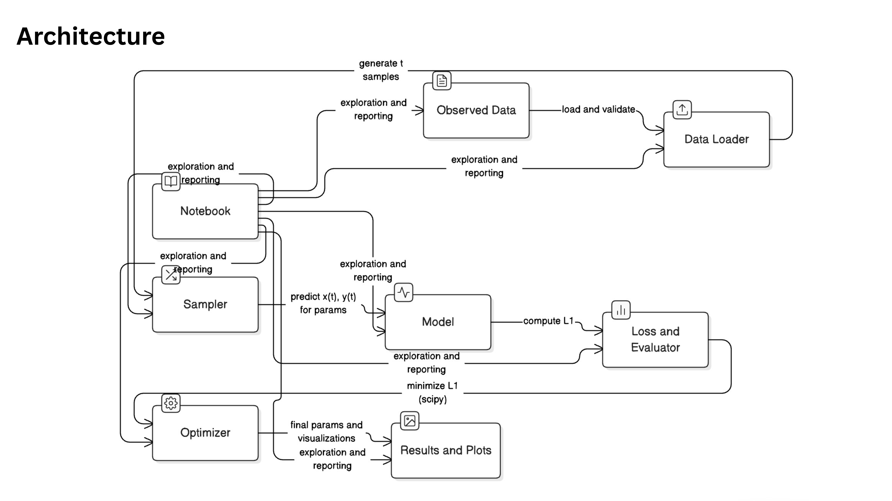

# Research & Development — Parametric Curve Fitting

Estimating unknown parameters in a parametric curve model using numerical optimization.

## Overview

This project implements a parameter estimation pipeline for the following parametric equations:

```
x(t) = t * cos(θ) - exp(M * |t|) * sin(0.3 * t) * sin(θ) + X
y(t) = 42 + t * sin(θ) + exp(M * |t|) * sin(0.3 * t) * cos(θ)
```

The goal is to estimate the unknown parameters θ, M, and X by minimizing the L1 distance (mean absolute error) between the observed data points and the predicted parametric curve.

## Requirements

- Python 3.11 or higher
- All dependencies listed in `requirements.txt`

Core packages:
- numpy >= 1.24.0
- pandas >= 2.0.0
- scipy >= 1.10.0
- matplotlib >= 3.7.0
- pytest >= 7.3.0

## Installation

### On macOS/Linux:

```bash
# Clone or extract the project
cd research_rd_project

# Create conda environment
conda create -n research_rd python=3.11 -y

# Activate conda environment
conda activate research_rd

# Install dependencies
pip install -r requirements.txt
```

### On Kaggle:

Upload the project files and install dependencies:

```python
!pip install -r requirements.txt
```

## Data

The project expects a CSV file `data/xy_data.csv` with the following format:

```csv
x,y
88.364456,57.784378
74.283936,54.40678
...
```

The CSV must contain:
- Column headers: `x` and `y`
- At least 10 data points
- No NaN values

The provided dataset contains 1502 observed (x, y) points sampled from the parametric curve for t ∈ (6, 60).

## Usage

### Run the Complete Pipeline

Execute the optimization pipeline:

```bash
python scripts/run_fit.py --data data/xy_data.csv --n-samples 200
```

Options:
- `--data`: Path to input CSV file (default: `data/xy_data.csv`)
- `--n-samples`: Number of uniform t samples (default: 200)
- `--output-dir`: Output directory for results (default: `results`)
- `--seed`: Random seed for reproducibility (default: 42)
- `--n-restarts`: Number of optimization restarts (default: 10)

### Run Jupyter Notebook

For interactive analysis:

```bash
jupyter notebook notebooks/analysis.ipynb
```

### Run Tests

Execute the test suite:

```bash
pytest -v tests/
```

## Results

The pipeline generates the following outputs in the `results/` directory:

1. **params.json**: Estimated parameters and L1 score
   ```json
   {
     "theta_deg": 30.0011,
     "theta_rad": 0.523618,
     "M": 0.030001,
     "X": 55.0033,
     "l1": 0.078631
   }
   ```

2. **fit_plot.png**: Visualization of observed data and fitted curve
3. **residuals_plot.png**: Residual analysis plots
4. **rd_pipeline.log**: Detailed execution log

## Evaluation

The L1 score is computed as the mean absolute distance between the predicted curve and observed data points.

To validate the results:

```bash
chmod +x scripts/validate_score.sh
./scripts/validate_score.sh
```

The script checks if the L1 score is below a threshold (default: 1.0, configurable via `L1_THRESHOLD` environment variable).

## Submission

### Final Estimated Parameters

The fitted parametric equations with estimated parameters are:

$$x(t) = t \cos(\theta) - e^{M|t|} \sin(0.3t) \sin(\theta) + X$$

$$y(t) = 42 + t \sin(\theta) + e^{M|t|} \sin(0.3t) \cos(\theta)$$

Where (estimated values from optimization):
- θ = 30.0011° (0.523618 rad)
- M = 0.030001
- X = 55.0033
- L1 Score = 0.078631

Parameter constraints:
- 0° < θ < 50°
- -0.05 < M < 0.05
- 0 < X < 100
- 6 < t < 60

### Architecture Diagram

The project architecture and data flow:



### Desmos Calculator

Copy the following equation into Desmos parametric graphing:

```
\left(t*\cos(0.523618)-e^{0.030001\left|t\right|}\cdot\sin(0.3t)\sin(0.523618)\ +55.0033,42+\ t*\sin(0.523618)+e^{0.030001\left|t\right|}\cdot\sin(0.3t)\cos(0.523618)\right)
```

Set the domain for parameter `t` as: `6 \leq t \leq 60`

Or visit: https://www.desmos.com/calculator/rfj91yrxob and paste the equation above.

## Assumptions & Trade-offs

### Optimization Approach

- **Multiple Restarts**: The optimizer uses 10 random restarts to avoid local minima
- **Methods**: Combines Nelder-Mead and Differential Evolution for robust global optimization
- **Sampling**: Uses uniform t-sampling in the range [6, 60] for curve evaluation

### Trade-offs

- **Computational Cost**: Multiple restarts increase computation time but improve solution quality
- **L1 vs L2**: L1 loss is more robust to outliers compared to L2 (MSE)
- **Sample Size**: Higher n-samples improves accuracy but increases computation time

### Reproducibility

All random operations use explicit seeds (default: 42) for reproducible results.

## Project Structure

```
research_rd/
├── README.md
├── requirements.txt
├── pyproject.toml
├── data/
│   └── xy_data.csv
├── src/
│   ├── __init__.py
│   ├── data_loader.py
│   ├── model.py
│   ├── loss.py
│   ├── optimizer.py
│   ├── utils.py
│   └── plotting.py
├── notebooks/
│   └── analysis.ipynb
├── results/
│   ├── params.json
│   ├── fit_plot.png
│   ├── residuals_plot.png
│   └── rd_pipeline.log
├── tests/
│   ├── conftest.py
│   ├── test_model_predict.py
│   └── test_optimizer_integration.py
├── scripts/
│   ├── run_fit.py
│   └── validate_score.sh
├── docs/
│   ├── derivation.md
│   └── Architecture.png
└── .env.example
```

## Contact

For questions or issues, please refer to the project documentation or contact the research team.
